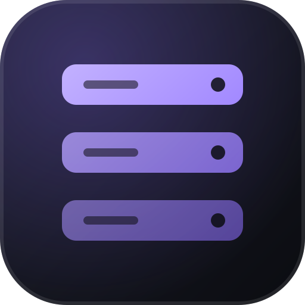

<div align="center">



# back-template-dotnet

**Un starter de Web API con ASP.NET Core con login, seguridad y una protección automática contra consultas N+1.**<br>
C#/.NET 10, EF Core y Postgres. Clónalo y empieza a construir la API de verdad.

[](https://github.com/obrenoalvim/back-template-dotnet/actions/workflows/ci.yml)
[](LICENSE)
[](https://github.com/obrenoalvim/back-template-dotnet/stargazers)
[](#qué-incluye)
[](#ejecución-local)

[English](README.md) · [Português](README.pt.md) · **Español**

[Qué incluye](#qué-incluye) · [Ejecución local](#ejecución-local) · [Pruebas](#pruebas) · [Configuración](#configuración) · [Familia de templates](#la-familia-de-templates) · [Preguntas frecuentes](#preguntas-frecuentes)

</div>

---

Starter de backend en C#/.NET 10: login, seguridad y pruebas listos para empezar a construir la API de verdad desde el primer día.

## Qué incluye

- ASP.NET Core Web API + EF Core 10 (Postgres vía Npgsql), patrón repository
- Autenticación JWT (registro/login, hash de contraseñas con BCrypt)
- **Protección automática contra consultas N+1** que corre como una prueba normal en CI (ver abajo)
- Rate limiting en los endpoints de auth (10 req/min por IP, contra fuerza bruta)
- Health check real (`/health` prueba la conexión verdadera con Postgres, no solo que "la app está arriba")
- Middleware global de excepciones (devuelve `ProblemDetails`, nunca un stack trace crudo)
- Documentación interactiva de la API con [Scalar](https://scalar.com) en `/scalar/v1` (entorno Development)
- Docker + docker-compose (API + Postgres), la imagen corre con un usuario sin privilegios (`app`, uid 1654)
- CI con GitHub Actions: build, pruebas (unitarias + de integración con `WebApplicationFactory`) y build de la imagen Docker en cada cambio

## Ejecución local

```bash
docker compose up -d
curl http://localhost:8081/health
```

La API aplica las migraciones de EF Core por sí sola al arrancar (`Database.Migrate()` en `Program.cs`). No hay nada que ejecutar a mano.

¿Quieres cambiar la contraseña de Postgres o la clave de firma del JWT sin editar `docker-compose.yml`? Copia `.env.example` a `.env` y ajusta. Si `.env` no existe, siguen valiendo los defaults de desarrollo de siempre.

**¿Tienes Postgres instalado de forma nativa en la máquina (no en Docker)?** Puede que ya esté ocupando el puerto 5432 del host, y Docker Desktop deja que ambos escuchen a la vez sin error. La conexión cae entonces en uno u otro al azar, y ves `password authentication failed` incluso con la contraseña correcta. Si pasa eso, detén el servicio local de Postgres o remapea el puerto en `docker-compose.yml` (por ejemplo `"5433:5432"`) antes de depurar cualquier otra cosa.

Endpoints:

```bash
curl -X POST http://localhost:8081/api/auth/register \
  -H "Content-Type: application/json" \
  -d '{"email":"you@example.com","password":"correct-horse-battery-staple"}'

curl -X POST http://localhost:8081/api/auth/login \
  -H "Content-Type: application/json" \
  -d '{"email":"you@example.com","password":"correct-horse-battery-staple"}'

curl http://localhost:8081/api/books -H "Authorization: Bearer <token>"
```

## Desarrollo sin Docker

Necesitas el [SDK de .NET 10](https://dotnet.microsoft.com/download) y un Postgres local (o `docker compose up -d postgres`).

```bash
dotnet restore
dotnet build
dotnet run --project src/BackTemplate.Api
```

## Pruebas

```bash
dotnet test
```

Las pruebas levantan un Postgres real con [Testcontainers](https://testcontainers.com/). Docker tiene que estar corriendo en la máquina (o en el runner de CI, que ya trae Docker). A propósito no se usa el provider `InMemory` de EF Core: `InMemory` no genera SQL real, así que no sirve para contar consultas.

Dos capas de pruebas:

- **Unitarias** (`Auth/`, `QueryCount/`): llaman al repositorio/servicio directamente, contra `AppDbContext`.
- **De integración** (`Integration/`): levantan toda la API con `WebApplicationFactory<Program>`. Enrutamiento, model binding, autenticación y rate limiting reales, golpeados por HTTP.

### Una trampa de configuración que detectaron las pruebas de integración

`Program.cs` usa top-level statements. Si lees `builder.Configuration.GetConnectionString(...)` en una variable local **antes** de `builder.Build()` y capturas esa variable en un closure (`options.UseNpgsql(connectionString)`), el `WebApplicationFactory` de las pruebas de integración no puede sobrescribir ese valor. La lectura ya ocurrió contra el `appsettings.json` real antes de aplicar la sobrescritura de la prueba. Por eso `ConnectionStrings`, `Jwt` y el health check de Postgres de este proyecto se resuelven todos **dentro** de los delegados de configuración (vía `IConfiguration`/`IOptions` inyectados), nunca desde una variable capturada demasiado pronto. Conviene mantener ese patrón al agregar configuración nueva.

### La protección contra N+1

`Diagnostics/QueryCountInterceptor.cs` cuenta cuántos comandos SQL ejecuta un `DbContext`. La prueba `BookRepositoryQueryCountTests` llama a `BookRepository.GetAllWithAuthorsAsync()` y verifica que ejecuta **exactamente 1 consulta**, sin importar cuántos libros existan.

Si alguien quita después el `.Include(b => b.Author)` del repositorio (o lo cambia por acceso lazy dentro de un bucle), esta prueba se pone en rojo en CI antes de convertirse en un problema de rendimiento en producción. No hace falta un profiler de pago ni una herramienta externa.

Para usar el mismo patrón en otros repositorios de tu proyecto:

```csharp
var interceptor = new QueryCountInterceptor();
await using var context = CreateContext(interceptor); // registers the interceptor on DbContextOptionsBuilder

interceptor.Reset();
var result = await myRepository.MethodThatShouldBeOneQuery();

Assert.Equal(1, interceptor.CommandCount);
```

## Agregar una migración

```bash
dotnet tool restore
dotnet ef migrations add MigrationName \
  --project src/BackTemplate.Api/BackTemplate.Api.csproj \
  --startup-project src/BackTemplate.Api/BackTemplate.Api.csproj \
  -o Data/Migrations
```

## Configuración

Variables de entorno (sobrescriben `appsettings.json`, sintaxis `Section__Key`):

| Variable | Descripción |
|---|---|
| `ConnectionStrings__Default` | Cadena de conexión de Postgres |
| `Jwt__Issuer` / `Jwt__Audience` | emisor/audiencia del token |
| `Jwt__SigningKey` | clave de firma HMAC: **cambia el valor por defecto antes de ir a producción** |
| `Jwt__ExpiryMinutes` | validez del token en minutos |

## Estructura

```
src/BackTemplate.Api/
  Auth/             register, login, JWT generation
  Controllers/      HTTP endpoints
  Data/             DbContext, entities, migrations
  Diagnostics/       QueryCountInterceptor (N+1 guard)
  Middleware/        global exception handling
  RateLimiting/      rate limit policy names
  Repositories/     data access

tests/BackTemplate.Tests/
  Auth/             register/login tests (calling the service directly)
  Integration/       tests hitting the real API via WebApplicationFactory
  QueryCount/       N+1 guard test
  TestFixtures/      Postgres fixture via Testcontainers
```

## Fuera de alcance (por ahora)

Front-end, despliegue automático en la nube y publicar la imagen Docker en un registry.

## Aviso conocido

`dotnet build`/`dotnet test` muestra una advertencia `NU1903` sobre una vulnerabilidad en el paquete `SSH.NET`. Es una dependencia transitiva de Testcontainers (solo para pruebas, nunca se publica en la imagen de producción). No hay riesgo para la API en ejecución.

---

## Preguntas frecuentes

**¿Qué base de datos usa?**
Postgres con Npgsql y EF Core 10. `docker compose up -d` levanta la API y Postgres juntos, y la API aplica las migraciones al arrancar.

**¿Qué es la protección contra N+1?**
Una prueba que cuenta los comandos SQL que ejecuta un `DbContext` y verifica que `GetAllWithAuthorsAsync()` ejecuta exactamente una consulta. Si alguien quita el `.Include`, la prueba falla en CI. Consulta [La protección contra N+1](#la-protección-contra-n1).

**¿Por qué Testcontainers en lugar del provider InMemory de EF Core?**
`InMemory` no genera SQL real, así que no puede contar consultas.

**¿Está listo para producción?**
Te da auth, rate limiting, un health check real y una imagen Docker sin root. Antes de desplegar, cambia `Jwt__SigningKey`. El front-end, el despliegue automático en la nube y publicar la imagen en un registry quedan fuera de alcance.

## La familia de templates

La misma idea con otro stack. Clona uno y empieza a construir.

| Capa | Starter |
|---|---|
| Backend | [Spring Boot](https://github.com/obrenoalvim/back-template-spring) · [Go](https://github.com/obrenoalvim/back-template-go) · [FastAPI](https://github.com/obrenoalvim/back-template-fastapi) · [NestJS](https://github.com/obrenoalvim/back-template-nest) · [Laravel](https://github.com/obrenoalvim/back-template-laravel) · **ASP.NET Core (este repo)** |
| Frontend | [Angular](https://github.com/obrenoalvim/front-template-angular) · [React](https://github.com/obrenoalvim/front-template-react) · [SvelteKit](https://github.com/obrenoalvim/front-template-sveltekit) · [Vue](https://github.com/obrenoalvim/front-template-vue) |
| Full-stack | [Next.js](https://github.com/obrenoalvim/next-template) |

## Licencia

[MIT](LICENSE)

---

<div align="center">

Si esto te ahorró un día de configuración, una ⭐ ayuda a que otras personas desarrolladoras lo encuentren.

<sub>**Temas:** aspnetcore · dotnet · csharp · web-api · entity-framework-core · jwt-authentication · postgresql · docker · testcontainers · boilerplate · starter-kit · backend-template</sub>

</div>
